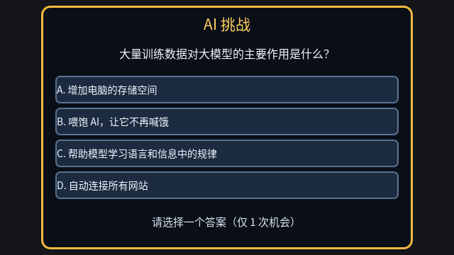
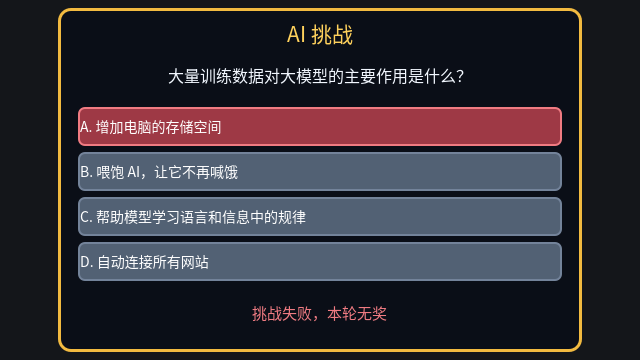
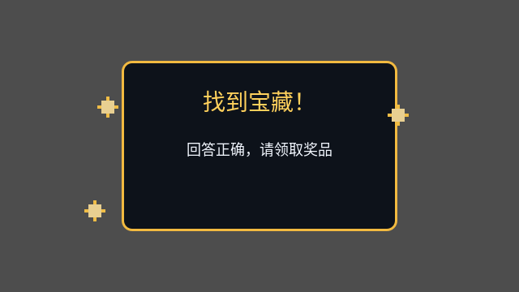

# AI 答题界面本地渲染证据

验证日期：2026-08-13

Godot：4.6.3 Compatibility / OpenGL 3.3

渲染尺寸：640×360 独立 `SubViewport`

渲染脚本：`tools/capture_quiz_evidence.gd`（需要图形渲染器，不使用 `--headless`）

Godot 输出确认三张 PNG 均为 `(640, 360)` 且保存返回码为 `OK`。本地目视检查结论：

- 初始答题：题目、四个选项和“仅 1 次机会”提示完整可读，无裁切或重叠。
- 首次答错：所选错误项变红、其余选项禁用，“挑战失败，本轮无奖”完整可读。
- 答对领奖：庆祝卡片、静态装饰和“回答正确，请领取奖品”完整可读；截图脚本隐藏动态粒子，避免随机粒子遮挡文字。

## 初始答题

## 首次答错

## 答对领奖

这些图片验证的是本地逻辑画布布局；目标展会电脑的全屏缩放、显示器色彩与鼠标手感仍按上一级手工 QA 清单现场检查。
